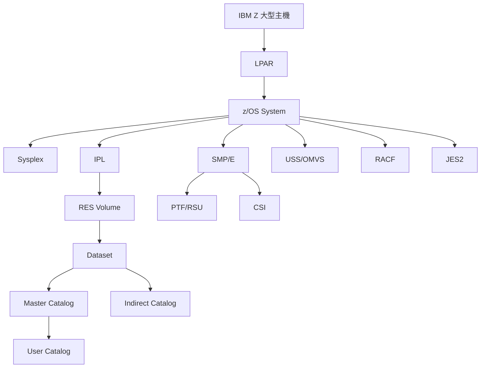

# z/OS 核心術語對照表

## 目的

這份文件建立 z/OS 與大型主機環境中最常見的核心術語對照表，幫助非大型主機背景的讀者快速理解這些術語的意義、與一般 IT 的類比、以及在本專案中的角色。

## 重要提醒

> **類比只是幫助理解，不代表完全等價**
> 
> 本文件提供的 Unix/Linux 類比是為了幫助建立初步理解，但 z/OS 有其獨特的技術架構與設計哲學。
> 
> 不要直接套用 Linux 經驗，而是先理解相似性，再學習 z/OS 特有的做法。

## 核心術語對照表

### 1. IPL (Initial Program Load)

**白話定義**：z/OS 的開機程序。

**一般 IT 類比**：
- Linux/Unix 的 `boot` 或 `reboot`
- 從 BIOS/UEFI 選擇開機磁碟並載入 OS
- GRUB 選擇 kernel entry 並啟動系統

**在本專案中的角色**：
- IPL 是切換 A/B 系統版本的關鍵動作
- 從不同的 LOAD ADDRESS 進行 IPL，就能啟動不同版本的 z/OS
- 例如：從 5F40 IPL 啟動 RES(A)，從 5F42 IPL 啟動 RES(B)

**重要差異**：
- IPL 不只是載入 kernel，還包含載入 IPLPARM、解析 LOADPARM、初始化 I/O configuration
- IPL 時會根據 LOAD ADDRESS 決定從哪個 RES volume 啟動

---

### 2. LPAR (Logical Partition)

**白話定義**：IBM Z 大型主機硬體層級的邏輯分割區，每個 LPAR 可以執行獨立的作業系統。

**一般 IT 類比**：
- VMware ESXi 上的一台 VM
- KVM/Xen 的 guest OS
- 但 LPAR 是 **firmware 層級**的分割，不是軟體虛擬化

**在本專案中的角色**：
- CONX 環境的 LPAR 名稱是 **BZ1516**
- LPAR ID 是 **15**
- 一個 LPAR 可以執行一個 z/OS system image

**重要差異**：
- LPAR 的隔離性與效能更接近實體機器
- LPAR 可以動態調整資源（CPU、記憶體）而不需要停機
- 一台 IBM Z 可以有多個 LPAR，每個跑不同 OS（z/OS、Linux、z/VM）

---

### 3. Sysplex

**白話定義**：多個 z/OS 系統協同運作的架構，可以共享資源、協調工作負載、提供高可用性。

**一般 IT 類比**：
- Kubernetes cluster（多節點協同）
- Windows Failover Cluster
- Linux HA cluster（Pacemaker + Corosync）
- 但 Sysplex 是 **OS 層級深度整合**的叢集架構

**在本專案中的角色**：
- CONX 是一個 Sysplex 名稱
- CX11 是 CONX Sysplex 中的一個 system name
- Dataset 命名會使用 `&SYSPLEX` 符號，例如 `OMVS.CONX.ROOT.A`

**重要差異**：
- Sysplex 不只是網路層級的 cluster，而是 OS 核心層級的協同
- 使用 Couple Dataset (CDS) 來共享狀態與協調資訊
- 支援 Parallel Sysplex（多系統同時存取相同資料）

---

### 4. Dataset

**白話定義**：z/OS 的資料集，是 z/OS 儲存資料的基本單位。不是一般的檔案系統檔案。

**一般 IT 類比**：
- 可以粗略想成「檔案」或「資料庫檔」
- 但 Dataset 有特殊的組織方式與存取方法
- 類似 Oracle 的 tablespace、DB2 的 dataset

**在本專案中的角色**：
- 系統程式庫：`SYS1.LINKLIB`、`SYS1.PARMLIB`
- USS root filesystem：`OMVS.CONX.ROOT.A`
- JES2 spool：`SYS1.CONX.HASPACE`

**重要差異**：
- Dataset 名稱不是 Unix path（不是 `/usr/lib`）
- Dataset 透過 **catalog** 解析到實體 volume
- Dataset 有不同類型：Sequential、PDS/PDSE、VSAM、zFS/HFS

---

### 5. Volume

**白話定義**：z/OS 的磁碟卷冊，每個 volume 有唯一的 volume serial。

**一般 IT 類比**：
- Linux 的 disk partition 或 LVM volume
- SAN LUN
- 磁碟 label 或 volume name

**在本專案中的角色**：
- RES(A) 使用 volume：`Z31RA1`、`Z31RA2`
- RES(B) 使用 volume：`Z31RB1`、`Z31RB2`
- Control volume：`CNXCT1`

**重要差異**：
- Volume serial 是 6 個字元的唯一識別碼
- Dataset 會被 catalog 記錄在哪個 volume 上
- IPL 時需要指定從哪個 volume 的哪個 address 啟動

---

### 6. DASD (Direct Access Storage Device)

**白話定義**：大型主機的磁碟裝置，通常指 3390 型號的磁碟。

**一般 IT 類比**：
- 硬碟（HDD）
- SAN storage
- 磁碟陣列

**在本專案中的角色**：
- 所有 RES volume、control volume、user volume 都是 DASD
- 每個 DASD 有硬體位址，例如 `5F40`、`5F41`

**重要差異**：
- DASD 是大型主機特有的術語
- 現代 DASD 通常是虛擬化的（透過 storage subsystem）
- DASD 的容量單位是 cylinder、track

---

### 7. RES (Residence Volume)

**白話定義**：z/OS 可以 IPL 的核心系統 volume，包含啟動所需的系統 dataset。

**一般 IT 類比**：
- Linux 的 `/boot` + root filesystem
- Windows 的 system volume (C:)
- AIX 的 rootvg

**在本專案中的角色**：
- RES(A)：目前穩定版本的系統 volume（Z31RA1、Z31RA2）
- RES(B)：升級後版本的系統 volume（Z31RB1、Z31RB2）
- 切換 A/B 就是從不同的 RES volume IPL

**重要差異**：
- RES 不是單一 volume，通常有多個（RES1、RES2）
- RES 包含 IPLTEXT、SYS1.LINKLIB、核心系統程式庫
- 透過 indirect catalog，可以讓 dataset 不寫死 volume

---

### 8. Master Catalog

**白話定義**：z/OS 的主要 catalog，用來解析 dataset 名稱到實體 volume。

**一般 IT 類比**：
- Linux 的 `/etc/fstab` + mount table
- DNS root zone（名稱解析的起點）
- Windows registry 中的 volume mapping

**在本專案中的角色**：
- CONX 的 master catalog：`MCAT.CONX`
- M301 的 master catalog：`MCAT.M301`
- Master catalog 是系統啟動時的關鍵 dataset

**重要差異**：
- Master catalog 是 VSAM dataset
- 所有 dataset 的解析都從 master catalog 開始
- Master catalog 可以指向 user catalog（delegated namespace）

---

### 9. User Catalog

**白話定義**：用來管理特定類別 dataset 的子 catalog。

**一般 IT 類比**：
- DNS delegated zone
- 子目錄的 mount point
- namespace delegation

**在本專案中的角色**：
- SMP/E 使用的 user catalog：`UCAT.SMPE`
- 將 SMP/E 相關 dataset 的解析委派給這個 catalog

**重要差異**：
- User catalog 可以簡化 dataset 管理
- 可以將不同類別的 dataset 分開管理
- 透過 alias 將特定 dataset prefix 指向 user catalog

---

### 10. Indirect Catalog

**白話定義**：Catalog entry 不直接記錄 volume serial，而是使用符號（如 `******` 或 `&SYSR2`），讓系統根據 IPL 時的 SYSRES 動態解析。

**一般 IT 類比**：
- Symbolic link
- Environment variable substitution
- Boot-time variable resolution

**在本專案中的角色**：
- 讓 A/B 版本可以共用相同的 catalog entry
- 例如 `SYS1.LINKLIB` 的 volume 是 `******`，IPL from A 時解析到 Z31RA1，IPL from B 時解析到 Z31RB1

**重要差異**：
- 這是 z/OS A/B 架構的關鍵技術
- 沒有 indirect catalog，就需要為 A/B 維護兩套 catalog
- Extended indirect catalog 支援 `&SYSR2`、`&SYSR3` 等多個 RES volume

---

### 11. SMP/E (System Modification Program/Extended)

**白話定義**：z/OS 用來安裝、追蹤、套用、回復系統元件與產品修正的標準工具。

**一般 IT 類比**：
- Linux 的 `yum`、`apt`、`zypper`
- 但 SMP/E 更嚴格、更主機導向
- 類似 package manager + patch management + rollback capability

**在本專案中的角色**：
- 在 M301 環境執行 SMP/E 維護作業
- Apply RSU/PTF 到 target libraries
- Clone 到 CONX RES(B) 進行測試

**重要差異**：
- SMP/E 有 RECEIVE、APPLY、ACCEPT、RESTORE 等階段
- 使用 CSI (Consolidated Software Inventory) 追蹤軟體狀態
- 有 Global Zone、Target Zone、DLIB Zone 的概念

---

### 12. PTF (Program Temporary Fix)

**白話定義**：IBM 發布的修正包，用來修正 z/OS 或產品的問題。

**一般 IT 類比**：
- Linux 的 package update 或 kernel patch
- Windows 的 hotfix 或 KB update
- 單一修正包

**在本專案中的角色**：
- RSU 是一組經過驗證的 PTF 集合
- 透過 SMP/E 套用 PTF 到系統

**重要差異**：
- PTF 有相依性（prerequisite、corequisite）
- PTF 可以被 APPLY（套用）但未 ACCEPT（接受）
- 未 ACCEPT 的 PTF 可以被 RESTORE（回復）

---

### 13. RSU (Recommended Service Upgrade)

**白話定義**：IBM 建議的一組維護修正集合，是經過整理與驗證的 PTF bundle。

**一般 IT 類比**：
- Linux 的 service pack 或 recommended patch set
- Windows 的 cumulative update
- 一批經過驗證的 patch bundle

**在本專案中的角色**：
- 目前 A 版的 RSU level：RSU2503
- 升級後 B 版的 RSU level：RSU26xx
- 透過套用 RSU 來升級系統維護等級

**重要差異**：
- RSU 是 IBM 定期發布的建議維護集合
- RSU 包含多個 PTF，已經過相容性測試
- 套用 RSU 比逐一套用 PTF 更安全

---

### 14. CSI (Consolidated Software Inventory)

**白話定義**：SMP/E 用來記錄軟體安裝狀態的資料庫。

**一般 IT 類比**：
- Linux 的 RPM database 或 dpkg status
- Package manager 的 installed package database
- Software inventory database

**在本專案中的角色**：
- M301 的 Global CSI：`SMPE.ZOSV31.GLOBAL.CSI`
- CONX 的 Target CSI A：`SMPE.ZOSV31.TARGET.RSUxxxxA.CSI`
- CONX 的 Target CSI B：`SMPE.ZOSV31.TARGET.RSUxxxxB.CSI`

**重要差異**：
- CSI 是 VSAM dataset
- A/B 版本各有自己的 Target CSI
- CSI 記錄了哪些 PTF 已 RECEIVE、APPLY、ACCEPT

---

### 15. USS (Unix System Services) / OMVS

**白話定義**：z/OS 上的 Unix 環境，提供 POSIX API 與 Unix-like filesystem。

**一般 IT 類比**：
- 就是 Unix/Linux 環境
- 提供 shell、filesystem、POSIX API

**在本專案中的角色**：
- USS root filesystem：`OMVS.CONX.ROOT.A` 或 `OMVS.CONX.ROOT.B`
- USS 也跟著 A/B 版本分離
- 可以在 USS 中使用 `ls`、`cd`、`vi` 等 Unix 指令

**重要差異**：
- USS 是 z/OS 的一部分，不是獨立 OS
- USS filesystem 是 zFS 或 HFS dataset
- USS 與傳統 z/OS dataset 可以互相存取

---

### 16. RACF (Resource Access Control Facility)

**白話定義**：z/OS 的安全管理系統，管理使用者、群組、權限、資源存取控制。

**一般 IT 類比**：
- Linux 的 PAM + `/etc/passwd` + LDAP + SELinux
- Windows Active Directory + Local Security Authority
- 但 RACF 的資源控制更細緻

**在本專案中的角色**：
- RACF Primary DB：`SYS1.RACF`（在 CNXCT1）
- RACF Backup DB：`SYS1.RACFSEC`（在 CNXPG1）
- 控制誰可以存取哪些 dataset、執行哪些指令

**重要差異**：
- RACF 可以控制 dataset、transaction、job、console command
- RACF 是 z/OS 安全的核心
- RACF 資料庫是 VSAM dataset

---

### 17. JES2 (Job Entry Subsystem 2)

**白話定義**：z/OS 的 batch job 管理子系統，負責 job 的輸入、排程、spool、輸出。

**一般 IT 類比**：
- Unix cron + batch queue + print spool
- Job scheduler + queue manager
- 但 JES2 是 z/OS batch workload 的核心基礎設施

**在本專案中的角色**：
- JES2 SPOOL：`SYS1.CONX.HASPACE`（在 CNXSP1）
- JES2 CKPT：`SYS1.CONX.HASPCKPT`（checkpoint dataset）
- 管理所有 batch job 的執行與輸出

**重要差異**：
- JES2 是 z/OS 的子系統，不是獨立程式
- JES2 spool 是 job input/output 的暫存區
- JES2 checkpoint 用於 JES2 狀態保存與恢復

---

### 18. LOADPARM (Load Parameter)

**白話定義**：IPL 時傳給系統的參數，指定系統要載入哪些設定。

**一般 IT 類比**：
- GRUB kernel command line
- Boot loader parameters
- Kernel boot options

**在本專案中的角色**：
- CONX 的 LOADPARM：`5F4400M1`
- 其中 `5F44` 是 control volume (CNXCT1) 的 address
- `00` 是 IPLPARM suffix
- `M1` 是其他參數

**重要差異**：
- LOADPARM 決定系統從哪裡找 IPLPARM、PARMLIB
- LOADPARM 格式有嚴格規定
- 不同的 LOADPARM 可以載入不同的系統設定

---

### 19. IEASYMxx

**白話定義**：z/OS system symbols 的設定成員，定義系統符號與變數。

**一般 IT 類比**：
- Environment variables
- Ansible inventory variables
- Boot-time configuration variables

**在本專案中的角色**：
- 定義 `&SYSR2`、`&SYSR3`、`&IPLVER` 等符號
- 例如：`SYMDEF(&SYSR2='&SYSR1(1:5).2')`
- 讓系統根據 IPL 的 RES volume 自動推導其他 volume

**重要差異**：
- IEASYMxx 在 IPL 時載入
- 系統符號會被用在 dataset naming、JCL、PARMLIB
- 這是 A/B 架構自動切換的關鍵

---

### 20. IEASYSxx

**白話定義**：z/OS 系統初始化參數設定成員。

**一般 IT 類比**：
- Linux kernel/systemd boot-time config
- `/etc/sysctl.conf`
- System initialization parameters

**在本專案中的角色**：
- 定義系統啟動時的各種參數
- 例如：要載入哪些 subsystem、使用哪些 PARMLIB member

**重要差異**：
- IEASYSxx 在 IPL 時載入
- 可以有多個 IEASYSxx member（IEASYS00、IEASYS01）
- 透過 LOADPARM 或 IPLPARM 指定要使用哪個

---

## 術語關係圖

## 如何使用這份對照表

1. **第一次閱讀**：先看白話定義，建立基本概念
2. **理解類比**：看一般 IT 類比，連結到你熟悉的技術
3. **了解角色**：看在本專案中的角色，知道為什麼重要
4. **注意差異**：看重要差異，避免誤解或錯誤類比

## 延伸閱讀

- 想看 Unix/Linux 完整對照：[unix-to-zos-mapping.md](unix-to-zos-mapping.md)
- 想看 z/OS 基本介紹：[what-is-zos.md](what-is-zos.md)
- 想看整體架構：[../02-architecture/README.md](../02-architecture/README.md)

## 重要提醒（再次強調）

這份對照表的類比是為了**幫助理解**，不是**完全等價**。

z/OS 有 50+ 年的演進歷史，有其獨特的設計哲學：
- 強調可靠性、可追蹤性、可回復性
- 嚴格的變更管理與軟體 inventory
- 深度整合的多系統協同架構
- 與一般 x86/Linux 有本質上的不同

學習 z/OS 時，先理解概念相似性，再學習 z/OS 特有的做法，不要直接套用 Linux 經驗。